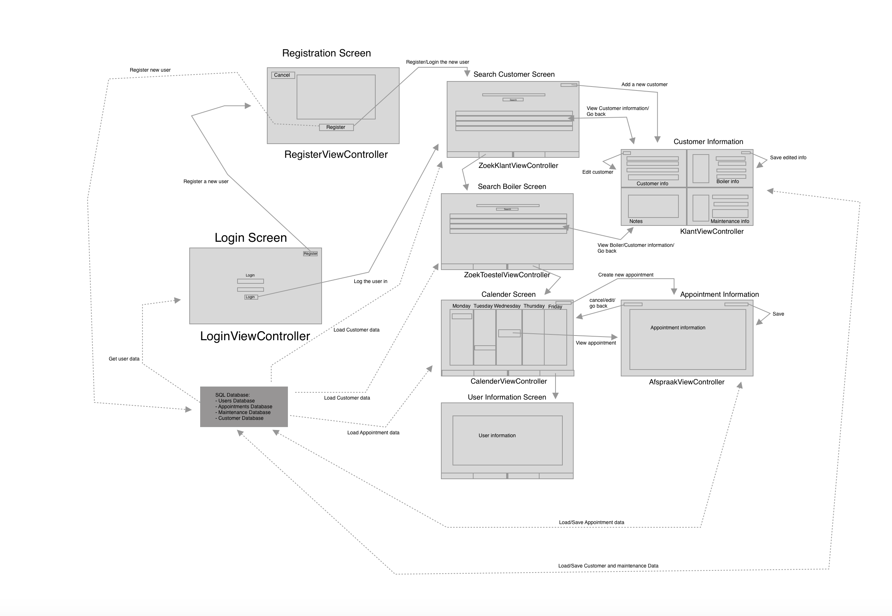
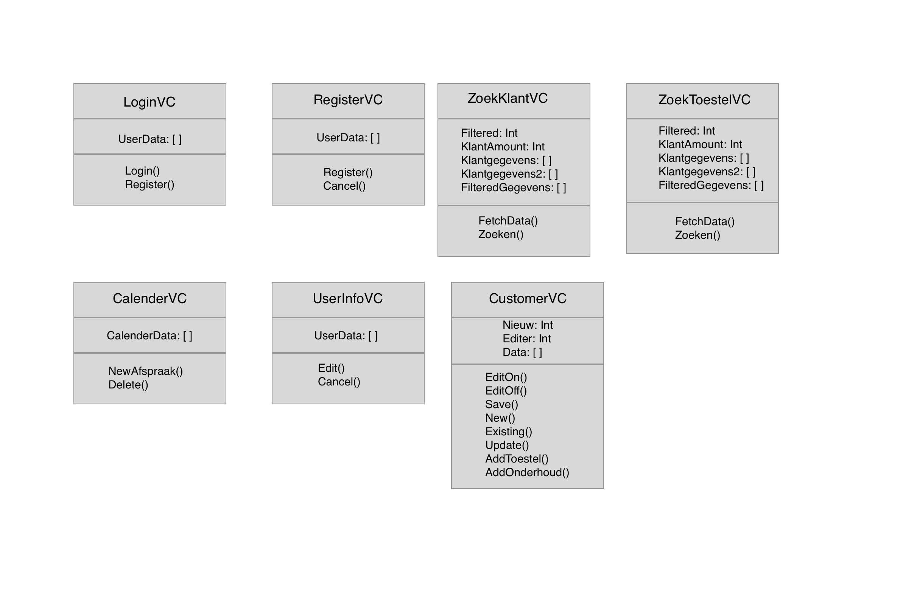

#  DesignDoc
## Technical Drawing

## Diagram

## Data
I am going to use a self created SQL Database with example data. This database will have data of the customers, the boilers, the maintenance and the appointments. Also will it have a database for users. The user can be an administrator or a normal user.
It is possible that i will use the Google Calender API for the calender view, but if it is possible i am going to use the Apple calender.
Link to Google Calender API: https://developers.google.com/calendar/ 

