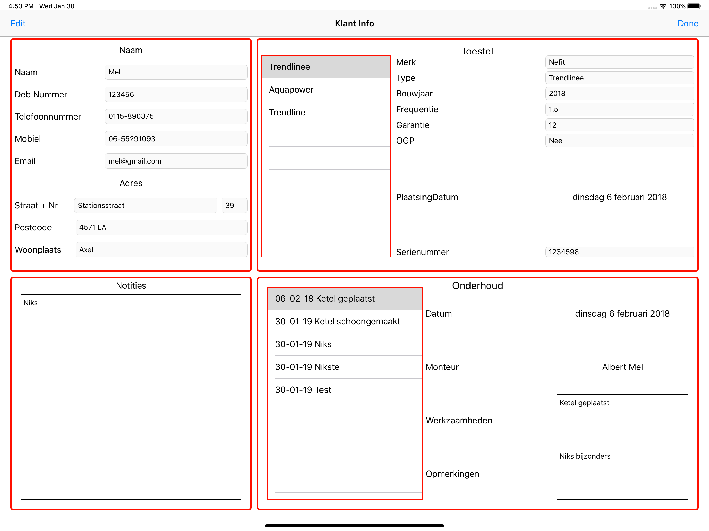
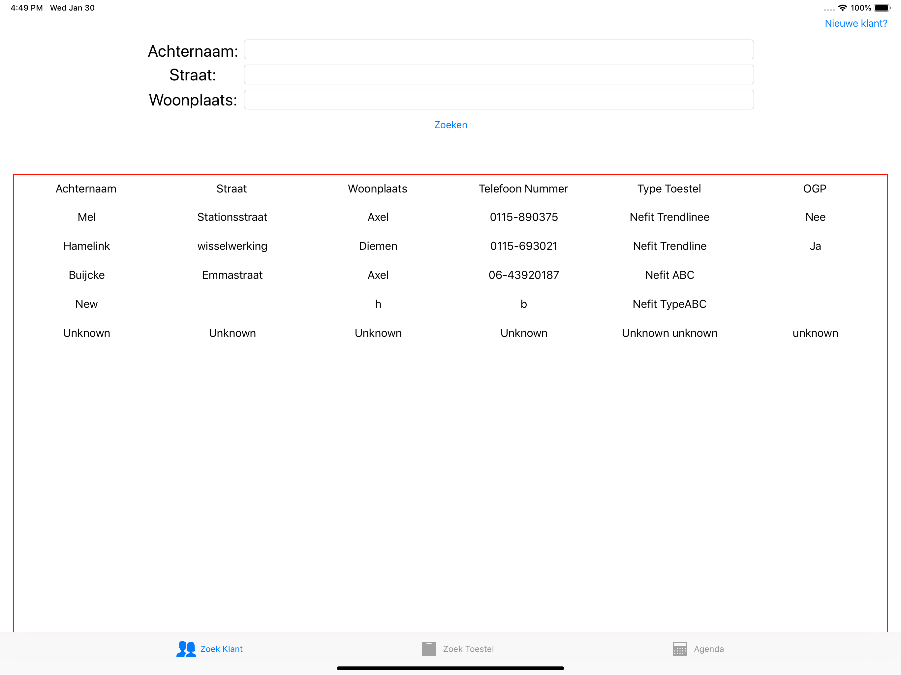

# KRS
KRM staat voor Klanten Registratie Manager. In deze app kunnen gebruikers een lijst met klanten bijhouden en de daarbij horen informatie zoals woonplaats en telefoonnummer. De gebruiker kan aan een klant ook een toestel toevoegen en aan een toestel kan ook weer een onderhoudsafspraak worden toegevoegd. Daarnaast kunnen er ook notities worden toegevoegd aan de klant.

Daarnaast heeft de gebruiker ook de mogelijkheid tot zoeken in de lijst via verschillende criteria. 

Ook kan de gebruiker een kalender bekijken en dagen selecteren om te zien welk onderhoud er die dag allemaal gedaan is.

### Informatie
Naam: Wessel Mel
Copyright Statement: Dit werk mag gebruikt worden mits er een vermelding wordt gedaan naar deze pagina.

### Gebruikte sources
CVCalendar: https://github.com/CVCalendar/CVCalendar
PHP: https://www.simplifiedios.net/swift-php-mysql-tutorial/
